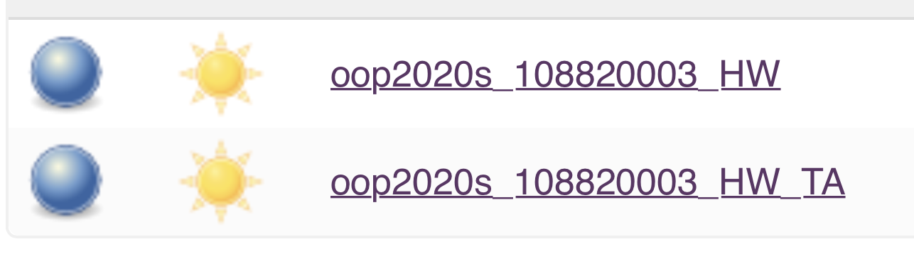

# 108820003_HW

## Hw-04 Test result: >>>  My HomeWork of OOP class at NTUT 2020.



```bash
[==========] Running 10 tests from 3 test suites.
[----------] Global test environment set-up.
[----------] 3 tests from HTML
[ RUN      ] HTML.appendText
[       OK ] HTML.appendText (0 ms)
[ RUN      ] HTML.appendImage
[       OK ] HTML.appendImage (0 ms)
[ RUN      ] HTML.render
[       OK ] HTML.render (0 ms)
[----------] 3 tests from HTML (0 ms total)

[----------] 3 tests from IMAGE
[ RUN      ] IMAGE.setSrc
[       OK ] IMAGE.setSrc (0 ms)
[ RUN      ] IMAGE.setPosition
[       OK ] IMAGE.setPosition (0 ms)
[ RUN      ] IMAGE.render
[       OK ] IMAGE.render (0 ms)
[----------] 3 tests from IMAGE (0 ms total)

[----------] 4 tests from TEXT
[ RUN      ] TEXT.render
[       OK ] TEXT.render (0 ms)
[ RUN      ] TEXT.setColor
[       OK ] TEXT.setColor (0 ms)
[ RUN      ] TEXT.setFontSize
[       OK ] TEXT.setFontSize (0 ms)
[ RUN      ] TEXT.setText
[       OK ] TEXT.setText (0 ms)
[----------] 4 tests from TEXT (0 ms total)

[----------] Global test environment tear-down
[==========] 10 tests from 3 test suites ran. (0 ms total)
[  PASSED  ] 10 tests.
```
